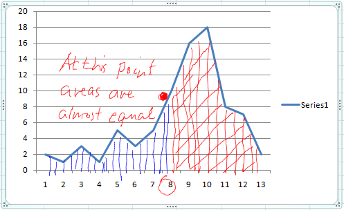
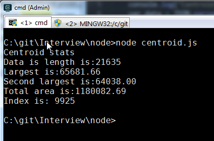
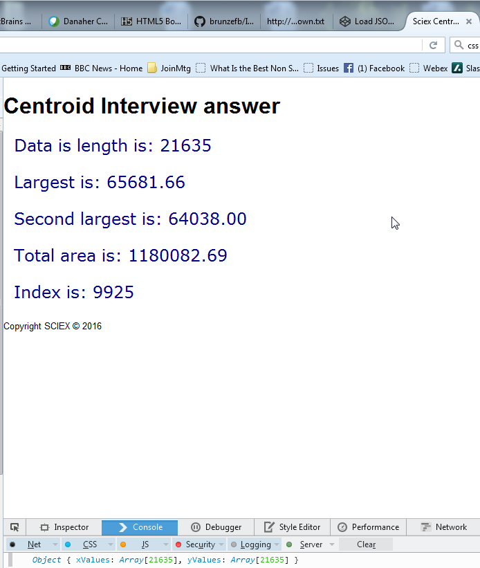

# Interview Questions (JavaScript)
#### The file data.json  in this repo contains data for the Sciex Interview problem.  Either clone the repo, or download the .zip file to get the data file.
   1. Find the number of elements (data length) in the XY array
   2. Find the highest valued data point in a given data set, output Y value
   2. Find the second highest valued data point in a data set, output Y value
   3. Find the lowest valued data point in a data set, output Y value
   4. Find the zero based median value (explained below), output index at which the median value is located.

The median value is the index at or just below which half the signal is found.

##JavaScript solutions  (do either #1 OR #2):
There is a data file checked into the repository, called **data.json**.  This file needs to be read into memory and the JSON parsed.

###\#1 Using Node.js
1.	Install Node.js on your platform of choice
2.	Run the finished program from the command line, which should output as follows:

 

###\#2  Using java script inside the browser:
1.	Create an html5 document
2.	Pull in your javascript.
3.	The javascript writes <p\> output to the browser DOM
4.	Style the text output with css, font colour dark blue, font=consolas, size=14pt
5.	Output should be similar to the screenshot above, except within the browser.
 

### Outputs
\#1 Node JS solution should be one or more .js file(s)

\#2 JS inside browser solution should one file with multiple sections, separated by ########### (.html, .js, .css etc).

#### Paste your final solution to the Inteviewzen.com site. 
